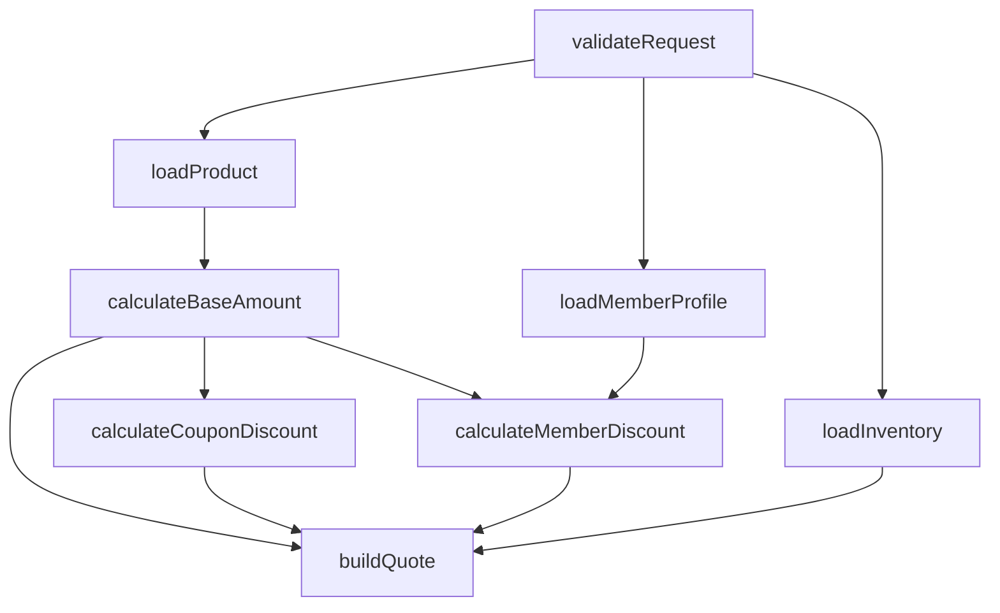

# ThreadPool

`ThreadPool` 是一个基于 Java 17 和 Spring Boot 3 的轻量级异步执行框架示例项目。
它最初提供线性异步流水线能力，现在已经扩展为同时支持：

- 线性 Pipeline 执行
- 基于依赖关系的 DAG 执行
- 按 `IO` / `CPU` / `DIRECT` 进行线程路由
- 通过 Spring Boot Starter 快速集成

仓库中包含框架本身、Spring Boot 自动装配，以及两个 demo：

- `threadpool-auth-demo`：线性登录流水线示例
- `threadpool-dag-demo`：DAG 编排与并行汇聚示例

## 项目目标

在真实业务中，一条请求链路往往混合了：

- 数据库查询、远程调用等阻塞 IO
- 密码校验、折扣计算、加密等 CPU 密集计算
- 多分支并发查询
- 汇聚多个分支结果再继续处理

这个项目的目标是把“做什么”和“在哪执行”拆开：

- 业务层定义步骤和依赖关系
- 框架层决定步骤调度到哪个线程池
- Spring Boot 自动装配负责把执行组件注册成 Bean

## 模块结构

父工程位于 `threadpool/`，当前包含以下模块：

### `threadpool-framework`

核心框架模块，提供：

- `AsyncPipeline`：线性异步流水线
- `AsyncPipelineBuilder`：线性流水线构建器
- `AsyncStep` / `AsyncStepFactory`：步骤抽象与步骤生成
- `ExecutionMode`：执行模式枚举
- `ExecutionDispatcher` / `ExecutorRegistry` / `ThreadPoolFactory`：线程池调度能力
- `StepDecorator`：日志、监控、追踪等横切扩展点
- `AsyncGraph`：DAG 执行器
- `AsyncGraphBuilder`：DAG 构建器
- `AsyncGraphNodeDefinition`：DAG 节点定义
- `GraphNodeInput`：节点输入与依赖结果视图
- `AsyncGraphTemplate`：可复用子图模板
- `AsyncGraphTemplateContext`：模板编排上下文
- `AsyncGraphTemplateInstance`：模板实例引用句柄

### `threadpool-spring-boot-autoconfigure`

Spring Boot 自动装配模块，默认注册：

- `ioExecutor`
- `cpuExecutor`
- `ExecutorRegistry`
- `ExecutionDispatcher`
- `AsyncStepFactory`
- `LoggingStepDecorator`
- `CompositeStepDecorator`

### `threadpool-spring-boot-starter`

Starter 模块，业务项目引入后即可获得框架与自动装配能力。

### `threadpool-auth-demo`

线性 Pipeline 示例，展示登录流程：

1. `loadUser`：数据库查用户，运行在 `IO`
2. `verifyPassword`：`BCrypt` 校验密码，运行在 `CPU`

### `threadpool-dag-demo`

DAG 示例，展示一个“报价预览”流程，其中包含并行分支和汇聚节点。

## 核心设计

### 1. 线性流水线

线性流水线适合“步骤严格串行”的业务。

核心抽象：

- `StepDefinition<C>`
- `AsyncStep<C>`
- `AsyncPipeline<C>`

典型链路：

```java
AsyncPipeline<LoginContext> pipeline = new AsyncPipelineBuilder<LoginContext>()
        .addStep(loadUser)
        .addStep(verifyPassword)
        .build();
```

### 2. DAG 执行模型

DAG 模型适合存在以下特征的业务：

- 同一个起点会分叉出多个独立步骤
- 各分支完成后需要汇聚结果
- 节点之间存在依赖关系，而不是简单顺序链

DAG 核心抽象：

- `AsyncGraph<C>`
- `AsyncGraphBuilder<C>`
- `AsyncGraphNodeDefinition<C>`
- `GraphNodeInput<C>`

特性：

- 依赖节点完成后才会执行当前节点
- 相互独立的节点可以并行运行
- 支持显式汇聚节点
- 支持子图复用与模板化编排
- 支持检测缺失依赖与环依赖
- 支持 `execute(...)` 获取单终点结果
- 支持 `executeAll(...)` 获取所有节点结果

## DAG 示例说明

`threadpool-dag-demo` 提供了一个新的独立 Spring Boot jar，用来演示 DAG 能力。

模块路径：

- `threadpool/threadpool-dag-demo`

启动类：

- `com.yeven.thread.dag.demo.DagDemoApplication`

配置文件：

- `threadpool-dag-demo/src/main/resources/application.yml`

默认端口：

- `8081`

### 场景：报价预览

接口：

```http
POST /quotes/preview
Content-Type: application/json
```

请求示例：

```json
{
  "userId": "u100",
  "sku": "sku-1001",
  "quantity": 2,
  "couponCode": "SAVE10"
}
```

返回字段包含：

- 商品名称
- 单价
- 会员等级
- 可用库存
- 基础金额
- 会员折扣
- 优惠券折扣
- 最终应付金额
- 是否库存充足

### DAG 拓扑

这个 demo 的流程不是一条线，而是一张图：



1. `validateRequest`
2. 从 `validateRequest` 分叉出三个并行 IO 节点
   - `loadProduct`
   - `loadInventory`
   - `loadMemberProfile`
3. `loadProduct` 完成后计算 `calculateBaseAmount`
4. `calculateBaseAmount` 与 `loadMemberProfile` 汇聚到 `calculateMemberDiscount`
5. `calculateBaseAmount` 单独进入 `calculateCouponDiscount`
6. 最后将以下结果汇聚到 `buildQuote`
   - `calculateBaseAmount`
   - `calculateMemberDiscount`
   - `calculateCouponDiscount`
   - `loadInventory`

这正好体现了 DAG 的两个核心价值：

- 并行查询
- 汇聚计算

另外，这个 demo 现在还演示了“模板化编排”：

- `ProductPricingTemplate`：封装商品加载与基础金额计算子图
- `DiscountTemplate`：封装会员折扣与优惠券折扣子图
- `QuoteFlowFactory` 通过 `addTemplate(...)` 将两个子图挂接到主图中

这样做的好处是：

- 相同结构的子图可以重复实例化
- 通过命名空间隔离节点名，避免冲突
- 通过绑定外部节点，把模板接到不同主图入口

### 关键代码位置

- DAG 定义：`threadpool-dag-demo/.../quote/flow/QuoteFlowFactory.java`
- 上下文模型：`threadpool-dag-demo/.../quote/context/QuoteContext.java`
- API 入口：`threadpool-dag-demo/.../quote/controller/QuoteController.java`
- 服务层：`threadpool-dag-demo/.../quote/service/QuoteService.java`
- 模拟 IO gateway：`threadpool-dag-demo/.../quote/gateway/*`

## 配置说明

线程池配置统一使用：

```yaml
threadpool:
  async:
    io:
      core-size: 8
      max-size: 8
      queue-capacity: 128
      keep-alive-seconds: 30
    cpu:
      core-size: 4
      max-size: 4
      queue-capacity: 64
      keep-alive-seconds: 30
```

说明：

- `io`：适用于 JDBC、HTTP、库存查询、商品查询等阻塞型任务
- `cpu`：适用于密码校验、价格计算、折扣计算等 CPU 密集任务
- `direct`：直接在当前调用线程执行

## 如何运行

### 环境要求

- JDK 17+
- Maven 3.9+

### 1. 构建所有模块

在 `threadpool/` 目录执行：

```bash
mvn -DskipTests install
```

### 2. 启动线性 Pipeline demo

```bash
cd threadpool-auth-demo
mvn spring-boot:run
```

默认端口：`8080`

### 3. 启动 DAG demo

```bash
cd threadpool-dag-demo
mvn spring-boot:run
```

默认端口：`8081`

### 4. 调用 DAG demo

```bash
curl -X POST http://localhost:8081/quotes/preview \
  -H "Content-Type: application/json" \
  -d "{\"userId\":\"u100\",\"sku\":\"sku-1001\",\"quantity\":2,\"couponCode\":\"SAVE10\"}"
```

## 当前能力边界

当前实现已经支持 DAG，但仍然保持轻量级，能力边界大致如下：

- 支持节点依赖调度
- 支持分支并行执行
- 支持显式汇聚节点
- 支持缺失依赖与环依赖检测
- 保留原有线性 Pipeline API

当前尚未覆盖的能力：

- 条件分支
- 动态子图生成
- 超时控制与重试策略
- 失败补偿与回滚编排
- 分布式任务协调

## 后续可扩展方向

- 为 DAG 增加条件分支能力
- 支持节点级别超时、重试和熔断策略
- 支持子图复用与模板化编排
- 给 `StepDecorator` 增加 metrics、trace、audit 等实现
- 为 demo 增加自动化测试与压测脚本

## 总结

这个项目现在包含两条清晰的主线：

- `threadpool-auth-demo`：展示线性异步流水线
- `threadpool-dag-demo`：展示 DAG 分支并发与汇聚

如果你想快速理解代码，建议按下面顺序阅读：

1. `threadpool-framework/.../pipeline/StepDefinition.java`
2. `threadpool-framework/.../pipeline/AsyncPipeline.java`
3. `threadpool-framework/.../pipeline/AsyncGraph.java`
4. `threadpool-framework/.../pipeline/AsyncGraphBuilder.java`
5. `threadpool-spring-boot-autoconfigure/.../ThreadPoolAutoConfiguration.java`
6. `threadpool-auth-demo/.../auth/flow/LoginFlowFactory.java`
7. `threadpool-dag-demo/.../quote/flow/QuoteFlowFactory.java`
