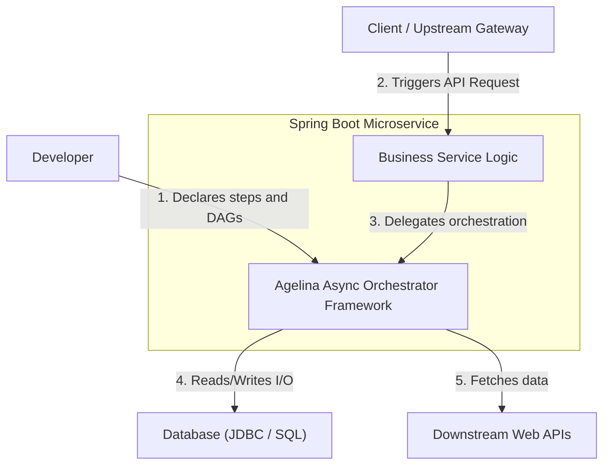
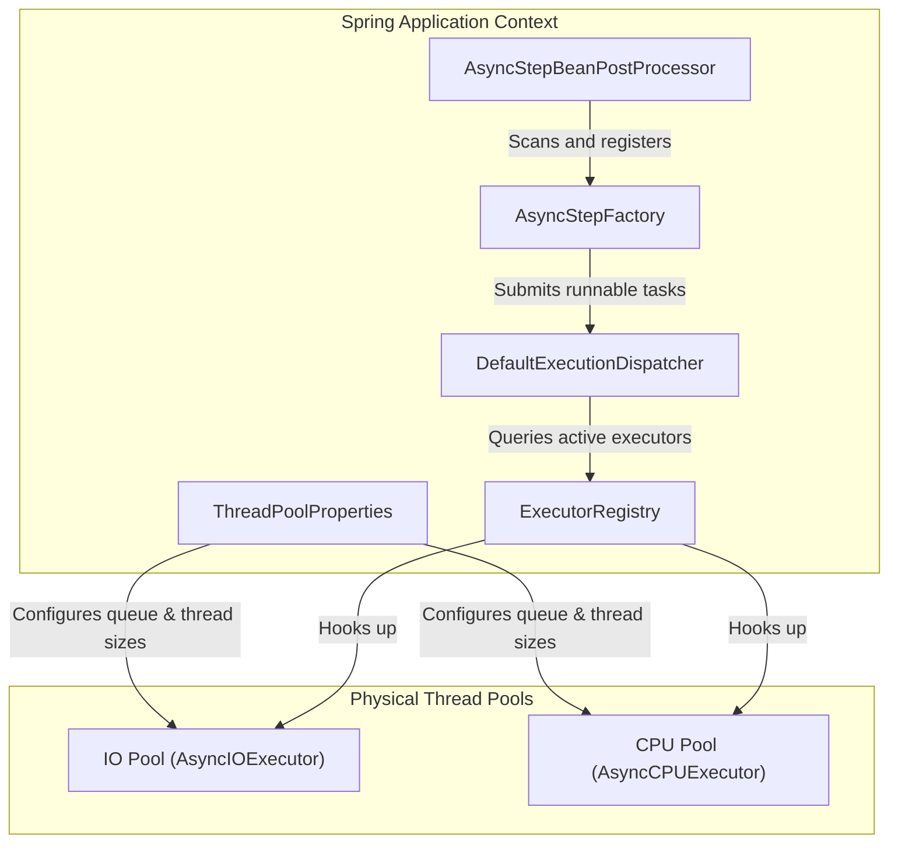
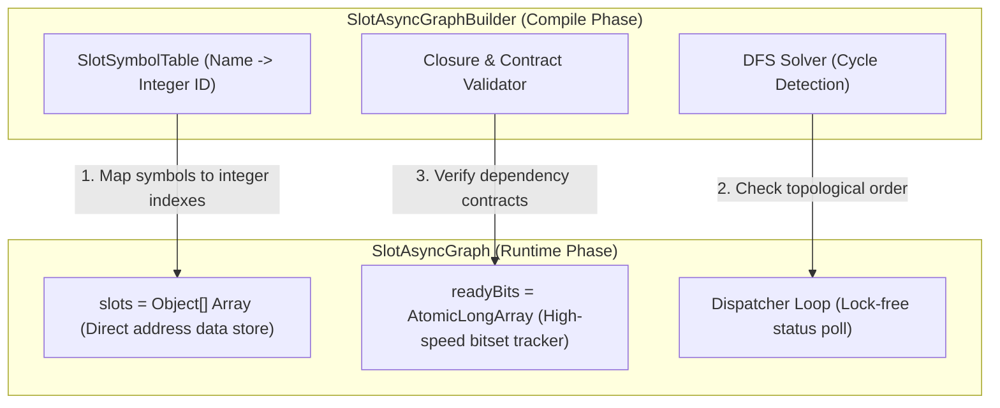
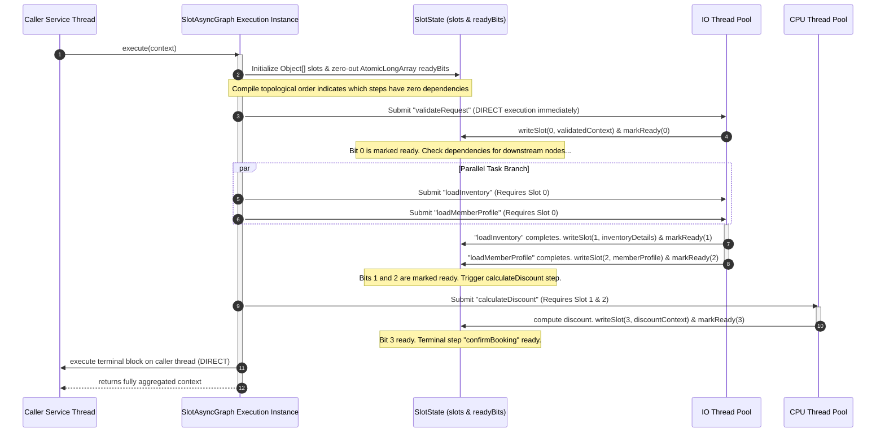

# C4 Architectural Blueprints and Sequence Models

Understanding the flow of parallel DAG execution requires clear, multi-tiered visual models. This guide compiles the Agelina structural blueprint mapped under the C4 Architecture model standard, along with high-fidelity Mermaid sequence diagrams detailing graph initialization, post-processing, and parallel runtime dispatching loops.

---

## 1. System Context (C4 Level 1)

This diagram shows the high-level boundary of the Agelina orchestrator within a Spring Boot microservice and its interactions with developers, clients, and external downstream dependencies.

---

## 2. Container Design (C4 Level 2)

This diagram drills down into the core container boundaries of Agelina, highlighting how the Spring context, configuration registries, execution dispatchers, and physically isolated thread pools cooperate.

---

## 3. Component Level Layout (C4 Level 3)

This diagram showcases the internal components of a running `SlotAsyncGraph`, detailing how symbolic slot definitions are compiled into lock-free array slot references and governed by bitmask trackers.

---

## 4. Graph Execution Sequence Model

This timeline details how a client service triggers a `SlotAsyncGraph` execution, how parallel steps are dispatched to isolated thread pools, how they update the atomic bitset upon completion, and how the caller thread joins and fetches the finalized output.

---

## 5. Design Rule Validation Verification

To ensure system reliability, the visual design model aligns with three architectural constraints:

1. **The Single-Writer Contract**: Multiple nodes can read from any slot in the `slots` array, but only a single designated node can write to it. This prevents thread write-collisions and keeps data immutable for readers.
2. **Context-Free Dispatching**: Dispatcher threads query the bitwise state of `readyBits` in CPU cache without obtaining standard mutex locks. This achieves massive scale-up throughput.
3. **No Unbound Queues**: Standard microservices should deploy with configured `queue-capacity` limits for the `IOExec` and `CPUExec` pools, ensuring that the backpressure boundaries shown in these diagrams are always active.
