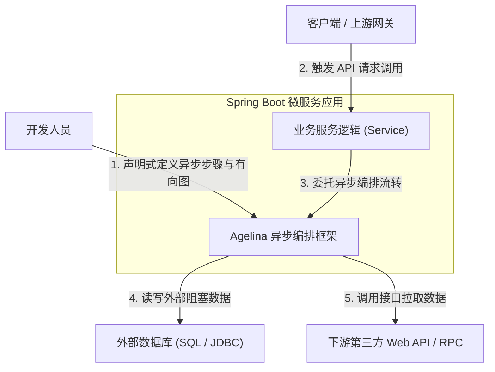
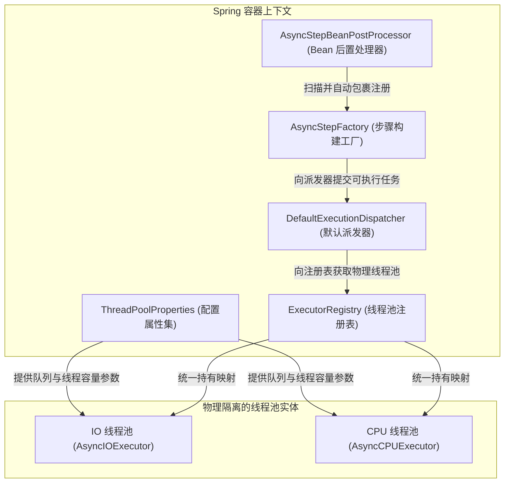
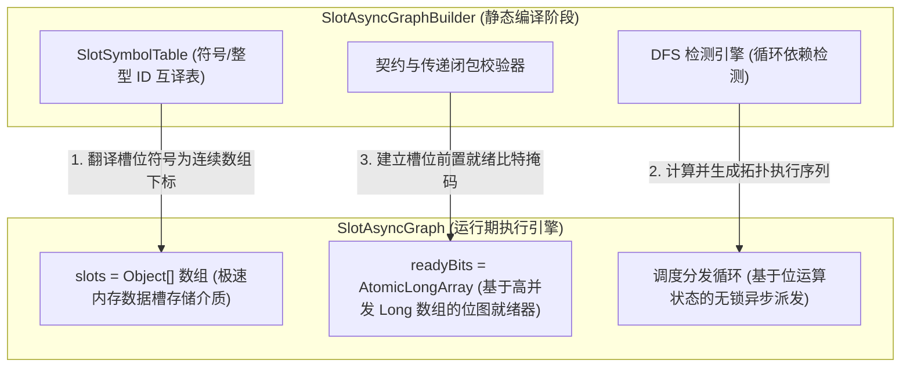
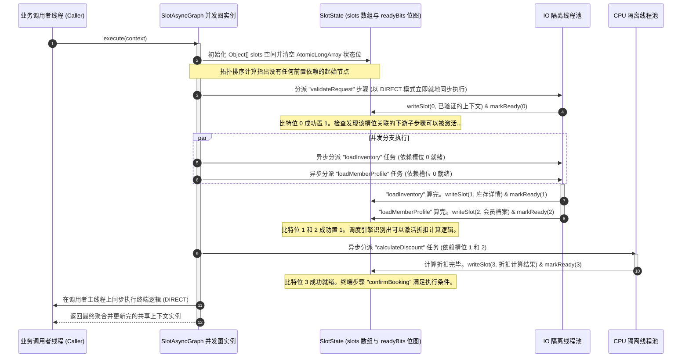

# C4 系统架构蓝图与时序图谱

理解并发有向无环图（DAG）的执行流程离不开清晰的多层次可视化模型。本指南整理了 Agelina 异步编排框架基于 C4 架构模型标准的结构蓝图，以及详细的 Mermaid 时序图，用以直观展现有向图初始化、Spring 扫描、编译和运行时并发调度流转的完整生命周期。

---

## 1. 系统上下文蓝图 (C4 Level 1)

本图展示了 Agelina 编排引擎在 Spring Boot 微服务应用中的宏观边界，以及开发人员、客户端与下游外部依赖系统之间的交互关系。

---

## 2. 容器设计蓝图 (C4 Level 2)

本图深入展现了 Agelina 内部的容器级模块边界，展示了 Spring 上下文、配置注册表、调度派发器与物理隔离线程池是如何协同工作的。

---

## 3. 组件级设计蓝图 (C4 Level 3)

本图详细描绘了运行中的 `SlotAsyncGraph` 的内部关键组件，展示了 Builder 阶段如何将字符串符号符号解析为数组槽位 ID，以及运行时如何利用位掩码进行高能控制。

---

## 4. 有向图并发调度运行时序图

本时序图描绘了当业务服务线程发起一次 `SlotAsyncGraph` 执行调用时，并发步骤是如何被分派给不同的物理隔离池，如何通过无锁 CAS 修改位图状态，以及主线程如何最终安全 Join 聚合结果的完整生命历程。

---

## 5. 系统架构规约审查对照

为了确保微服务在生产环境下的极高稳定性，系统的可视化架构设计契合以下三条核心架构规约：

1. **单一写入契约（Single-Writer Contract）**：虽然多个并发的异步节点可以同时从 `slots` 数组中并行读取任何已就绪的槽位数据，但有且仅有一个确定的步骤拥有向该槽位写入的特权。这彻底杜绝了并发多线程的写覆盖与指令重排冲突，使数据在读取者眼中具有绝对的不变性。
2. **零临界区阻塞（Lock-Free Dispatching）**：调度引擎的核心循环在检查节点就绪度时，只会在 CPU Cache 层面进行高频的 `readyBits` 原子位图检索，不需要获取任何操作系统级别的互斥排它锁（Mutex Locks）。这保证了多核心环境下的极限高吞吐。
3. **有界队列红线（No Unbound Queues）**：生产环境部署时必须为 `IOExec` 和 `CPUExec` 线程池配置明确的 `queue-capacity` 阻塞容量限制，确保这套背压防护机制在面对突发流量冲击时随时可用。
